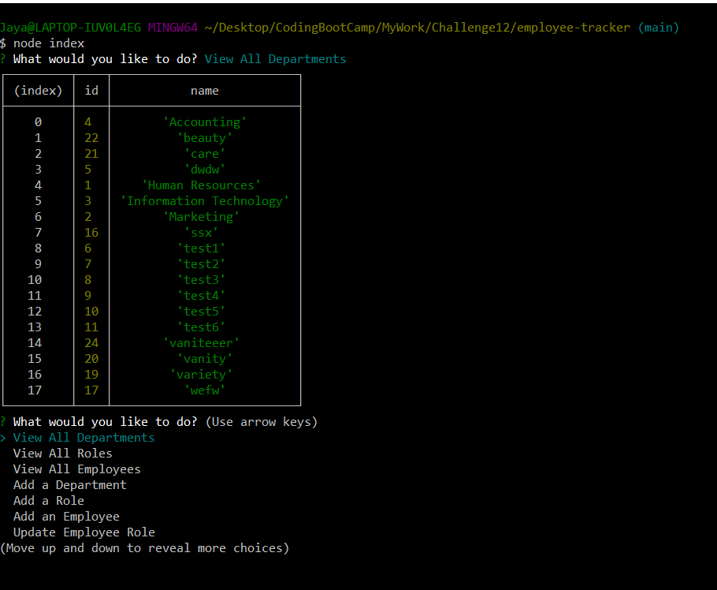
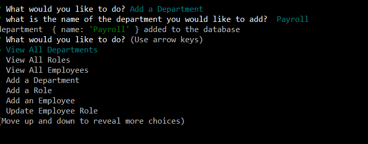
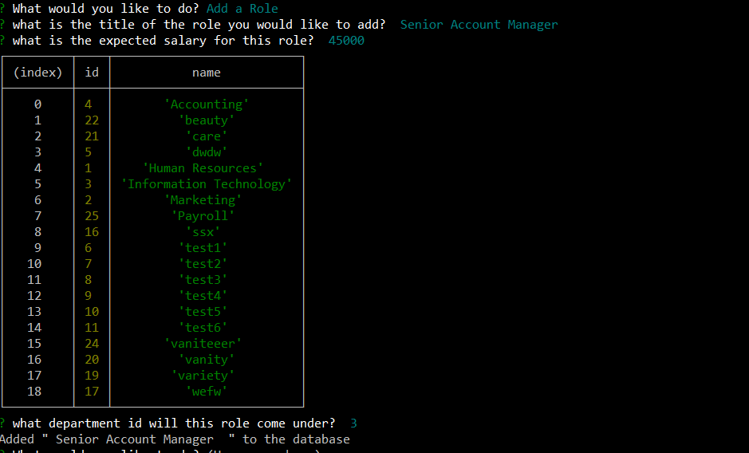
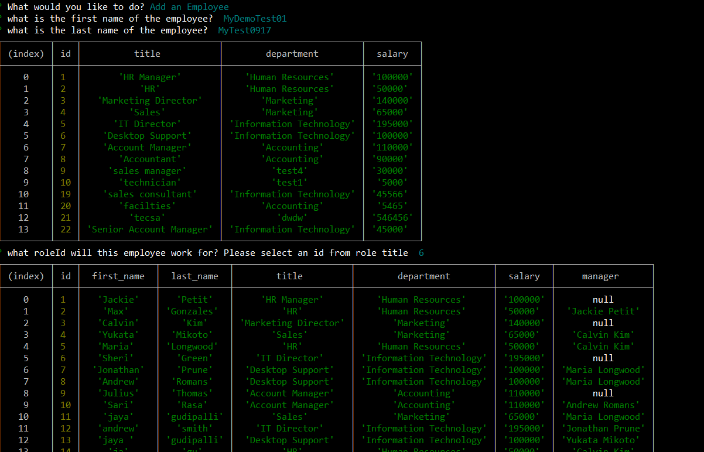
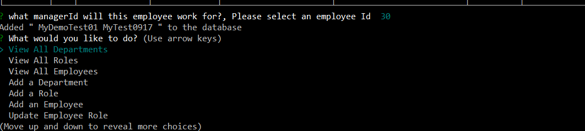
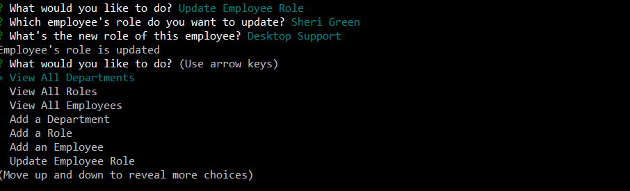

# Employee Tracker

* Github : https://jaya1983.github.io/employee-tracker/
* Walkthrough video : 

# Description
* A command-line application to manage a company's employee database, using Node.js, Inquirer, and MySQL.

# Screenshots

# Technologies Used
* Node.js

* NPM

* MySQL

* Inquirer.js

* Node MySQL 2

* console.table

# Contributor:
Jaya Gudipalli All Rights Reserved.